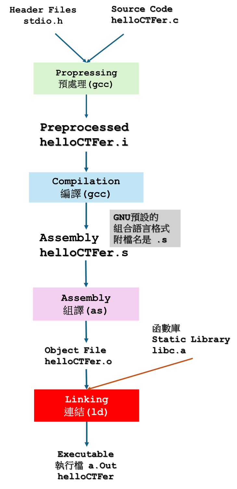
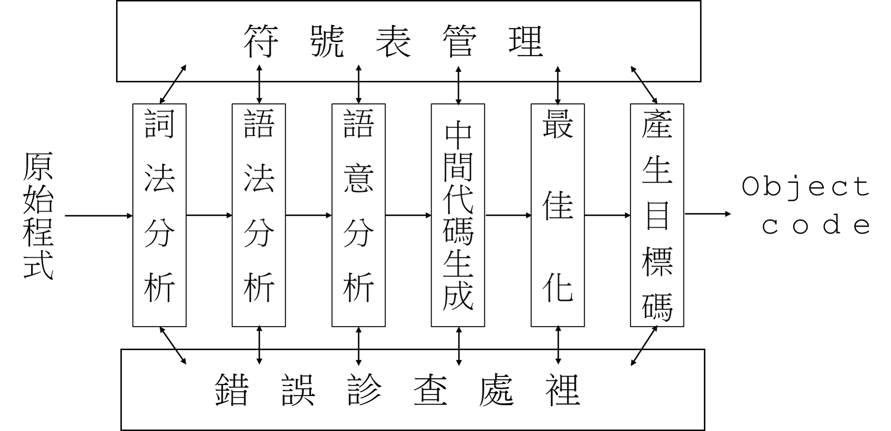

# 1-2從原始碼到可執行檔 [20240128直播錄影](https://youtu.be/S8uVTIzeYmw)

- 預處理階段
  - 處理原始程式檔中以“＃”開始的前編譯指令。比如此＃include”、“＃define”等，
  - 主要處理規則：
    - 將所有的“＃define＂刪除，並且展開所有的巨集定義。
    - 處理所有條件前編譯指令，比如＂＃if＇、“＃ifdef＂、“＃elif＇、“＃else’，、“＃endif’
    - 處理“＃include”前編譯指令，將包含的檔案插入到該前編譯指令的位置。
      - 這個過程是遞迴進行的，也就是說包含的檔案可能還包含其他檔。
    - 刪除所有的註解“//”和“/＊ ＊/”
    - 添加行號和檔案名稱標誌，比如＃2 “helloCTFer.c” 2 ，以便於編譯時編譯器產生除錯用的行號資訊，及用於編譯時產生編譯錯誤或警告時能顯示行號。
    - 保留所有的＃pragma 指令，因為編譯器需要使用它們。
```c
#include <stdio.h>

#define FORMAT_STRING "%s"
#define MESSAGE "Hello, CTFer!\n"

int
main(int argc, char *argv[]) {
  printf(FORMAT_STRING, MESSAGE);
  return 0;
}
```
- 編譯階段:超複雜流程(只要瞭解基本觀念即可)

  - 後續延伸閱讀:
    - 編譯原理, 2/e (Compilers : Principles, Techniques, and Tools, 2/e)
      - [英文版](https://www.tenlong.com.tw/products/9781292024349?list_name=trs-f)
      - [繁體中譯本(已絕版)](https://www.tenlong.com.tw/products/9789861549361?list_name=trs-t)
      - [簡體中譯本](https://www.tenlong.com.tw/products/9787111251217?list_name=srh)
    - [自製編譯器 自制编译器 [日]青木峰郎](https://www.tenlong.com.tw/products/9787115422187?list_name=srh)
  
- 組譯階段
  - 將組合語言程式碼轉成機器可以執行的指令(instructions)
  - 每一個組語語句都對應一機器指令。
  - 組譯器的組譯過程相對於編譯器來講比較簡單
  - 它沒有複雜的語法，也沒有語意，也不需要做指令最佳化，只是根據組語指令和機器指令的對照表一一翻譯就可以
- 連結階段

## 推薦閱讀
- [程式設計師的自我修養－連結、載入、程式庫](https://www.tenlong.com.tw/products/9789861818283)
  - ch2.編譯與連結 
- 高級 C/C++ 編譯技術 (典藏版) Advanced C and C++ Compiling
  - [英文原版](https://www.tenlong.com.tw/products/9781430266679?list_name=srh)
  - [簡體中譯本](https://www.tenlong.com.tw/products/9787111717300?list_name=srh)
  - 第2章程序生命週期階段基礎(Simple Program Lifetime Stages)
- 下階段學習重點: 函數庫(動態連結 Dynamic Library vs 靜態連結 Static Library)

## gcc的參數
- 原始程式: XXX.c
- 預處理階段 ==> gcc –E XXX.c –o XXX.i
- 編譯階段 ==> gcc –S XXX.i  –o XXX.s
- 組譯階段 ==> gcc –c XXX.s –o XXX.o
- 連結階段 ==> gcc  XXX.o –o XXX
- export LD_LIBRARY_PATH=.


### 原始程式: helloCTFer.c
```c
#include <stdio.h>

int main()
{
   printf("Hello CTFer\n ”);
   return 0;
}
```
### 預處理階段 ==> gcc –E helloCTFer.c –o helloCTFer.i
- 檢視helloCTFer.i ==> cat helloCTFer.i
```c
[XD] % cat helloCTFer.i
# 1 "helloCTFer.c"
# 1 "<built-in>"
# 1 "<command-line>"
# 31 "<command-line>"
# 1 "/usr/include/stdc-predef.h" 1 3 4
# 32 "<command-line>" 2
# 1 "helloCTFer.c"
# 1 "/usr/include/stdio.h" 1 3 4
# 27 "/usr/include/stdio.h" 3 4
# 1 "/usr/include/x86_64-linux-gnu/bits/libc-header-start.h" 1 3 4
# 33 "/usr/include/x86_64-linux-gnu/bits/libc-header-start.h" 3 4
# 1 "/usr/include/features.h" 1 3 4
# 424 "/usr/include/features.h" 3 4
# 1 "/usr/include/x86_64-linux-gnu/sys/cdefs.h" 1 3 4
# 427 "/usr/include/x86_64-linux-gnu/sys/cdefs.h" 3 4
# 1 "/usr/include/x86_64-linux-gnu/bits/wordsize.h" 1 3 4
# 428 "/usr/include/x86_64-linux-gnu/sys/cdefs.h" 2 3 4
# 1 "/usr/include/x86_64-linux-gnu/bits/long-double.h" 1 3 4
# 429 "/usr/include/x86_64-linux-gnu/sys/cdefs.h" 2 3 4
# 425 "/usr/include/features.h" 2 3 4
# 448 "/usr/include/features.h" 3 4
# 1 "/usr/include/x86_64-linux-gnu/gnu/stubs.h" 1 3 4
# 10 "/usr/include/x86_64-linux-gnu/gnu/stubs.h" 3 4
# 1 "/usr/include/x86_64-linux-gnu/gnu/stubs-64.h" 1 3 4
# 11 "/usr/include/x86_64-linux-gnu/gnu/stubs.h" 2 3 4
# 449 "/usr/include/features.h" 2 3 4
# 34 "/usr/include/x86_64-linux-gnu/bits/libc-header-start.h" 2 3 4
# 28 "/usr/include/stdio.h" 2 3 4


# 1 "/usr/lib/gcc/x86_64-linux-gnu/7/include/stddef.h" 1 3 4
# 216 "/usr/lib/gcc/x86_64-linux-gnu/7/include/stddef.h" 3 4
很長

.....

extern char *ctermid (char *__s) __attribute__ ((__nothrow__ , __leaf__));
# 840 "/usr/include/stdio.h" 3 4
extern void flockfile (FILE *__stream) __attribute__ ((__nothrow__ , __leaf__));

extern int ftrylockfile (FILE *__stream) __attribute__ ((__nothrow__ , __leaf__)) ;

extern void funlockfile (FILE *__stream) __attribute__ ((__nothrow__ , __leaf__));
# 868 "/usr/include/stdio.h" 3 4

# 2 "helloCTFer.c" 2

# 3 "helloCTFer.c"
int main()
{
   printf("Hello CTFer\n ");
   return 0;
}
```
### 編譯階段 ==> gcc –S helloCTFer.i  –o helloCTFer.s
- 檢視helloCTFer.s ==>cat `helloCTFer.s` <==這是GNU Assembler(gas|as)產生的組合語言程式:格式是 AT&T syntax.(第三單元會說明)
```
	.file	"helloCTFer.c"
	.text
	.section	.rodata
.LC0:
	.string	"Hello CTFer\n "
	.text
	.globl	main
	.type	main, @function
main:
.LFB0:
	.cfi_startproc
	pushq	%rbp
	.cfi_def_cfa_offset 16
	.cfi_offset 6, -16
	movq	%rsp, %rbp
	.cfi_def_cfa_register 6
	leaq	.LC0(%rip), %rdi
	movl	$0, %eax
	call	printf@PLT
	movl	$0, %eax
	popq	%rbp
	.cfi_def_cfa 7, 8
	ret
	.cfi_endproc
.LFE0:
	.size	main, .-main
	.ident	"GCC: (Ubuntu 7.5.0-3ubuntu1~18.04) 7.5.0"
	.section	.note.GNU-stack,"",@progbits
```
### 組譯階段 ==> gcc –c helloCTFer.s –o helloCTFer.o
- 檢視helloCTFer.o 檔案格式==>   file helloCTFer.o
- helloCTFer.o: ELF 64-bit LSB relocatable, x86-64, version 1 (SYSV), not stripped

### 連結階段 ==> gcc  helloCTFer.o –o helloCTFer

### 執行程式 ==> ./helloCTFer

### 檢視檔案大小==> ls -al helloCTFer.*
```
-rw-r--r-- 1 user user    77 Jan 25 22:30 helloCTFer.c
-rw-r--r-- 1 user user 17958 Jan 25 22:31 helloCTFer.i
-rw-r--r-- 1 user user  1552 Jan 25 22:39 helloCTFer.o
-rw-r--r-- 1 user user   485 Jan 25 22:34 helloCTFer.s
```
- [XD] % ls -al helloCTFer  
```
-rwxr-xr-x 1 user user 8304 Jan 25 22:59 helloCTFer
```
# 編譯過程補充說明  ==> 產生不同組合語言格式
- 組合語言格式:INTEL vs AT&T 格式
- 產生AT&T語法格式的組語(gcc預設使用的格式) ==> gcc -S `-masm=att` XXXXX.c -o XXXXX_att.s
- 產生Intel語法格式的組語(微軟預設使用的格式) ==> gcc -S `-masm=intel` XXXXX.c -o XXXXX_intel.s
- helloCTFer_att.s
```c
	.file	"helloCTFer.c"
	.text
	.section	.rodata
.LC0:
	.string	"Hello CTFer\n "
	.text
	.globl	main
	.type	main, @function
main:
.LFB0:
	.cfi_startproc
	pushq	%rbp
	.cfi_def_cfa_offset 16
	.cfi_offset 6, -16
	movq	%rsp, %rbp
	.cfi_def_cfa_register 6
	leaq	.LC0(%rip), %rdi
	movl	$0, %eax
	call	printf@PLT
	movl	$0, %eax
	popq	%rbp
	.cfi_def_cfa 7, 8
	ret
	.cfi_endproc
.LFE0:
	.size	main, .-main
	.ident	"GCC: (Ubuntu 7.5.0-3ubuntu1~18.04) 7.5.0"
	.section	.note.GNU-stack,"",@progbits
```
- helloCTFer_intel.s
```c
	.file	"helloCTFer.c"
	.intel_syntax noprefix
	.text
	.section	.rodata
.LC0:
	.string	"Hello CTFer\n "
	.text
	.globl	main
	.type	main, @function
main:
.LFB0:
	.cfi_startproc
	push	rbp
	.cfi_def_cfa_offset 16
	.cfi_offset 6, -16
	mov	rbp, rsp
	.cfi_def_cfa_register 6
	lea	rdi, .LC0[rip]
	mov	eax, 0
	call	printf@PLT
	mov	eax, 0
	pop	rbp
	.cfi_def_cfa 7, 8
	ret
	.cfi_endproc
.LFE0:
	.size	main, .-main
	.ident	"GCC: (Ubuntu 7.5.0-3ubuntu1~18.04) 7.5.0"
	.section	.note.GNU-stack,"",@progbits
```
- 要去掉一堆註解:請加上參數-fno-asynchronous-unwind-tables
- gcc -S `-masm=intel` helloCTFer.c -o helloCTFer_intel_2.s -fno-asynchronous-unwind-tables
- helloCTFer_intel_2.s
```c
	.file	"helloCTFer.c"
	.intel_syntax noprefix
	.text
	.section	.rodata
.LC0:
	.string	"Hello CTFer\n "
	.text
	.globl	main
	.type	main, @function
main:
	push	rbp
	mov	rbp, rsp
	lea	rdi, .LC0[rip]
	mov	eax, 0
	call	printf@PLT
	mov	eax, 0
	pop	rbp
	ret
	.size	main, .-main
	.ident	"GCC: (Ubuntu 7.5.0-3ubuntu1~18.04) 7.5.0"
	.section	.note.GNU-stack,"",@progbits
```


