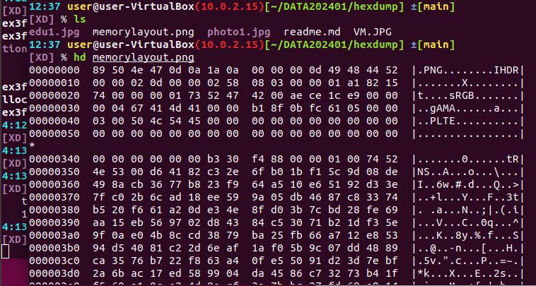
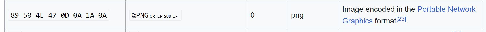

# 2-1.基本Linux 執行檔分析:file|string|hexdump(hd)|size
- file
- string
- hexdump|hd
- size

### 下載練習檔案
- https://github.com/MyFirstSecurity2020/DATA202401/tree/main
- git clone https://github.com/MyFirstSecurity2020/DATA202401.git
- cd DATA202401
- ls

### Linux file命令(command)
- 用途:用來辨識檔案類型。
- 語法(Syntax): file [-bcLvz][-f <檔案列表>][-m <魔法數位檔>...][檔案或目錄...]
- 參數：
```
-b 　列出辨識結果時，不顯示檔案名稱。
-c 　詳細顯示指令執行過程，便於排錯或分析程式執行的情形。
-f <檔案列表> 　指定名稱檔，其內容有一個或多個檔案名稱時，讓file依序辨識這些檔，格式為每列一個檔案名稱。
-L 　直接顯示符號連接所指向的檔的類別。
-m <魔法數位檔> 　指定魔法數位檔。
-v 　顯示版本資訊。
-z 　嘗試去解讀壓縮檔的內容。
[檔案或目錄...] 要確定類型的檔案列表，多個檔之間使用空格分開，可以使用shell萬用字元匹配多個檔。
```
- 範例
  - https://www.runoob.com/linux/linux-comm-file.html
  - https://www.hostinger.com/tutorials/linux-file-command/
  - https://www.geeksforgeeks.org/file-command-in-linux-with-examples/
  - https://phoenixnap.com/kb/linux-file-command
- 練習:
  - file /bin/ls
  - file memorylayout.png
  - file xxx.docx
  - file xxx.pdf

### strings 
- 用途:列印檔案中可列印字串(print the strings of printable characters in files)
- 語法(Syntax): strings [options] filename   | grep 關鍵字 檔案1 檔案2 ...
- 參數(options):
  - https://www.tutorialspoint.com/unix_commands/strings.htm
  - 檢視參數 ==> strings -help
- 範例
  - strings /bin/ls
  - strings /bin/ls | grep Copyright
  - strings XXXXXX | grep CTF
- 參考資料:
  - https://allabouttesting.org/strings-command-in-linux-with-examples/  
- 超強大的grep[參考資料]
  - 語法(Syntax): grep [option...] [patterns] [file...]
  - [推薦閱讀][Linux 匹配文字 grep 指令用法教學與範例](https://blog.gtwang.org/linux/linux-grep-command-tutorial-examples/)
  - https://www.gnu.org/software/grep/manual/grep.html

 ### hecdump|hd
 - Hexdump is a utility that displays the contents of binary files in hexadecimal, decimal, octal, or ASCII.
 - It's a utility for inspection and can be used for data recovery, reverse engineering, and programming.
 - 語法(Syntax):hd [OPTIONS...] [FILES...]
 - 參數(options):
   - https://man7.org/linux/man-pages/man1/hexdump.1.html 
 - 範例練習
   - https://github.com/MyFirstSecurity2020/DATA202401/tree/main
   - git clone https://github.com/MyFirstSecurity2020/DATA202401.git
   - cd DATA202401
   - ls
   - cd hexdump
   - hd memorylayout.png



   - 上網找.png的`檔案特徵(file signature)`  https://en.wikipedia.org/wiki/List_of_file_signatures



 - 隨堂練習:顯示執行畫面與解說
   - ELF(Executable and Linkable Format) 的檔案特徵
   - MP3 的檔案特徵
   - word的檔案特徵
   - .jpg 的檔案特徵
   - .pcapng(網路封包)的檔案特徵
 - 作業:參考底下文章完成測試報告(echo 龍大大在2024 MyFirstProgSec 的練習)
   - [hexdump command in Linux with examples](https://www.geeksforgeeks.org/hexdump-command-in-linux-with-examples/) 
 - 延伸閱讀
   - [How Hexdump works](https://opensource.com/article/19/8/dig-binary-files-hexdump#:~:text=Hexdump%20is%20a%20utility%20that,%2C%20reverse%20engineering%2C%20and%20programming.)


### size
- 用途:
  - 列出二進位檔案的節大小(section sizes)和總大小
  - list section sizes and total size of binary files
- 語法(Syntax):
- 參考資料
  - https://man7.org/linux/man-pages/man1/size.1.html


### CTF練習題
- 完成easyctf的練習
  - 檔案路徑 DATA202401/Day1/hexedit
  - [檔案](https://github.com/MyFirstSecurity2020/DATA202401/tree/main/RE)
- 完成CSAW Quals CTF的練習
  - 檔案路徑 DATA202401/Day1/networkingOK.pcap

### CTF:自己出題自己解  MyFirstProgSec CTF
```c
#include <stdio.h>

void secretFunction()
{
  printf("MyFirstProgSec{You hAve Done a great joB!}\n");
}

void myecho()
{
    char buffer[20];

    printf("Enter some text:\n");
    scanf("%s", buffer);
    printf("You entered: %s\n", buffer);    
}

int main()
{
    myecho();
    return 0;
}
```


