# 3-1.計算機結構與組合程式
## 機器碼(machine code| instruction set)與組合程式(assembly program)
- 程式語言演化

- [Kathleen Booth, Creator of the First Assembly Language](https://thenewstack.io/kathleen-booth-creator-of-the-first-assembly-language/#:~:text=Kathleen%20Booth%2C%20who%20celebrated%20her,on%20computer%20design%20and%20programming)
  - 1947年 Kathleen and Andrew Donald Booth: Coding for A.R.C
  - 1951年 Wilkes、Wheeler和Gill 出版的書籍The Preparation of Programs for an Electronic Digital Computer《電子數位電腦程式的準備》
  - 組合語言(assembly program)依賴機器碼指令(machine code| instruction set)，因此每種組合語言都只是用於特定的電腦體系結構
  - 電腦體系結構 有許多: ARM  ARM (thumb)  AArch64 | MIPS(32)  MIPS(64) | PowerPC(32)  PowerPC(64) | Sparc | x86(16)  x86(32)  x86(64)
  - 就有許多組合語言 =＝＞所以就有許多組合語言課程:
    - Widnows Assembly programming(MASM vs NASM): 32-bit vs 64 bit
    - Linux Assembly programming(GAS vs NASM): 32-bit vs 64 bit
    - ARM Assembly programming : 32-bit vs 64 bit
- 機器碼(machine code| 指令集instruction set)與組合程式(assembly program)

### 線上反組譯服務 
- https://defuse.ca/online-x86-assembler.htm
- 測試範例: 55 8b ec 機器碼的組合語言為何?
- Google一下online disassembler看看其他的線上服務
- [Intel x86 Assembler Instruction Set Opcode Table](http://sparksandflames.com/files/x86InstructionChart.html)

# 計算機結構主題
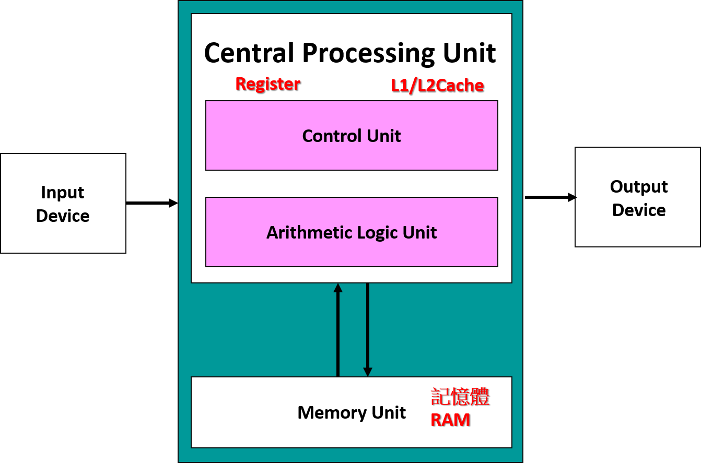

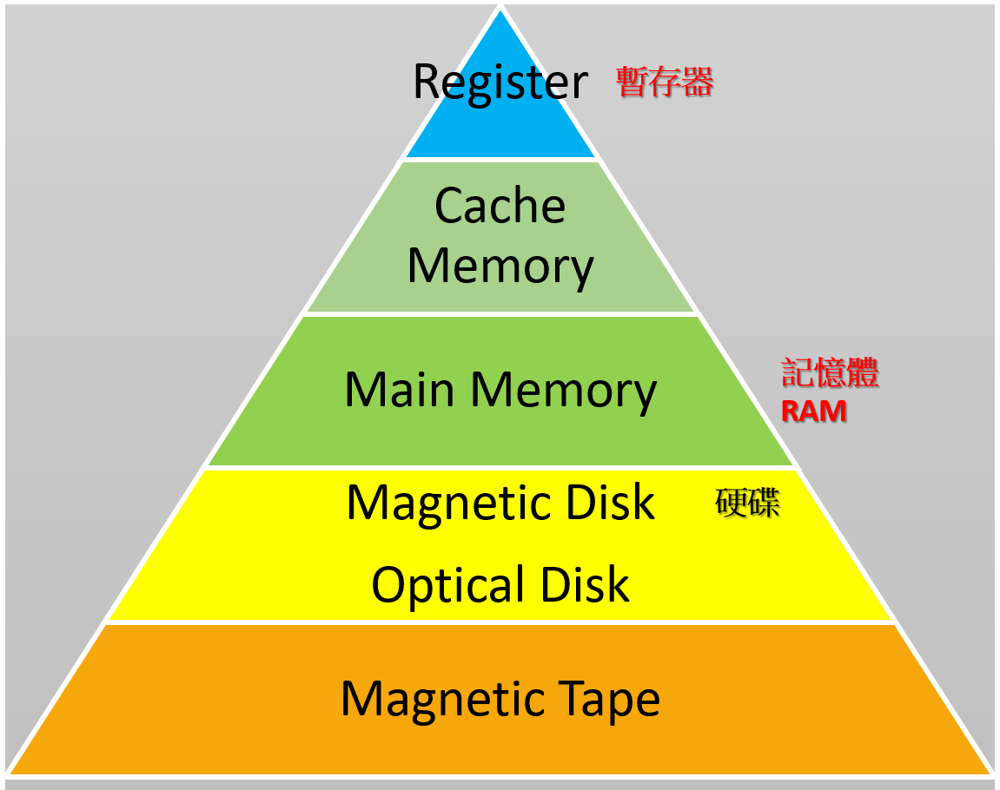

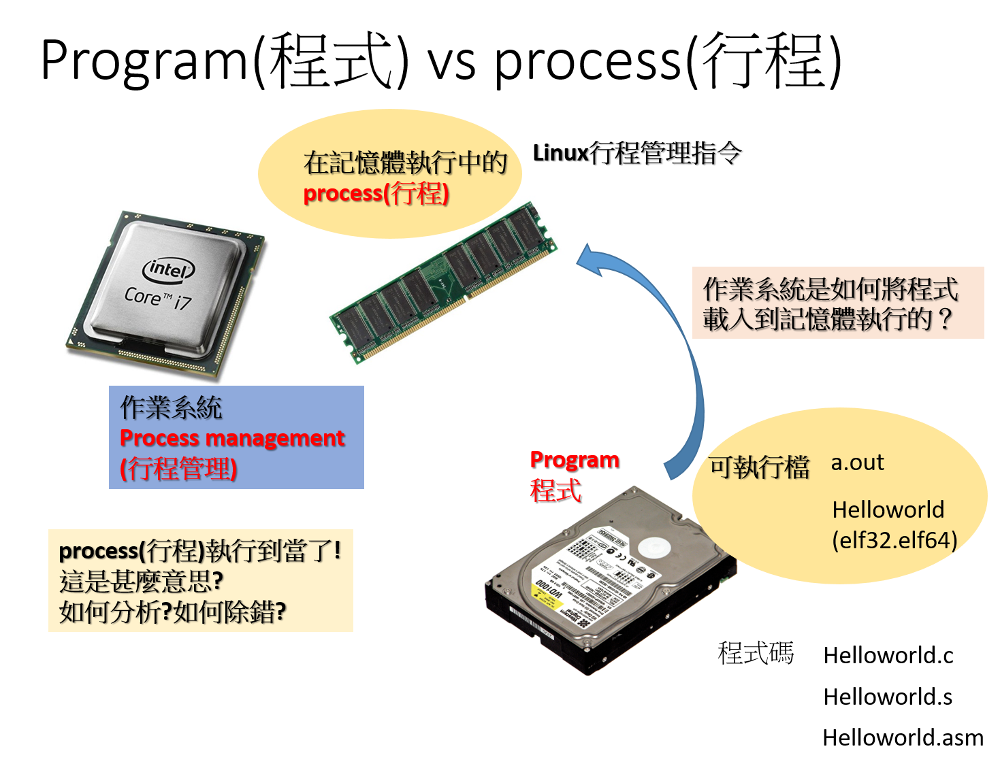
- instruction set architecture (ISA) ==> RISC vs CISC
  - 參考資料:https://en.wikipedia.org/wiki/Instruction_set_architecture
  - 指令集架構|Instruction Set Architecture|ISA|指令集或指令集體系
    - 電腦架構中與程式設計有關的部分
    - 包含了基本資料類型，指令集，暫存器，定址模式，儲存體系，中斷，異常處理以及外部I/O。
    - 指令集架構包含一系列的opcode即操作碼（機器語言），以及由特定處理器執行的基本命令。
  - 精簡指令集運算（Reduced Instruction Set Computing，RISC）:
    - 早期工作站系統架構 + 現代ARM手機系統架構
    - 早期工作站系統架構:惠普的PA-RISC，國際商業機器的PowerPC，康柏（後被惠普收購）的Alpha，美普思科技公司的MIPS，SUN公司的SPARC
    - 現代ARM手機系統架構:ARM公司的ARM架構 ==> Raspberry PI
      - https://en.wikipedia.org/wiki/ARM_architecture_family
      - https://www.arm.com/zh-TW/architecture/cpu : Arm 架構是一系列適用於電腦處理器的精簡指令集運算 (RISC) 架構。
      - 它是世界上最普及的處理器架構，我們的合作夥伴在過去 30 年已出貨超過 2,700 億個 Arm 架構晶片，產品範圍從感測器、穿戴式裝置及智慧型手機到超級電腦。
      - Raspberry Pi 樹莓派
        - 樹莓派系列電腦每一代均使用Broadcom出產的ARM架構處理器
        - Raspberry Pi Foundation ==> https://www.raspberrypi.org/ 
    - 作業系統支援: 以Raspberry Pi 樹莓派為例
      - 官方提供的作業系統:。最基礎的的Raspberry Pi OS，Raspberry Pi OS（64-bit）、Raspberry Pi OS（Legacy）與Raspberry Pi OS Desktop
        - [【工具教學】以VM 方式安裝 Raspberry Pi Desktop](https://makerpro.cc/makerlearn/courses/use-virtual-machine-to-setup-raspberry-pi-desktop/)
      - 更多作業系統請參看 https://zh.wikipedia.org/zh-tw/%E6%A0%91%E8%8E%93%E6%B4%BE 
    - 開發工具:
      - ARM (32-bit) assembly language programming
        - [ARM assembly-language programming for the Raspberry Pi](https://kevinboone.me/pi-asm-toc.html)
          - GITHUB ==> https://github.com/kevinboone/pi-asm 
      - ARM (64-bit) assembly language programming
        - [匯編語言（基於64位ARMv8體系結構） 錢曉捷](https://www.tenlong.com.tw/products/9787121443718?list_name=lv)
        - 在Linux平臺使用GCC編譯套件，介紹64位ARM指令集和匯編語言
        - 內容包括匯編語言基礎知識，AArch64編程結構，整數處理、存儲器訪問、分支和調用基礎指令，匯編語言分支、循環和子程序結構等。 
  - 複雜指令集運算（Complex Instruction Set Computing，CISC）
    - 32位元x86架構微處理器如Intel的Pentium/Celeron/Xeon與AMD的Athlon/Duron/Sempron
    - 64位元擴充系統的x86-64架構的Intel 64的Intel Core/Core 2/Celeron/Pentium/Xeon與AMD64的Phenom II/Phenom/Athlon 64/Athlon II/Opteron/AMD APU/Ryzen/EPYC都屬於複雜指令集。
    - 作業系統
      - 微軟的Windows
      - 蘋果公司的macOS
      - Linux等。
    - [Intel® 64 and IA-32 Architectures Software Developer Manuals](https://www.intel.com/content/www/us/en/developer/articles/technical/intel-sdm.html)
    - https://www.intel.com.tw/content/www/tw/zh/content-details/782158/intel-64-and-ia-32-architectures-software-developer-s-manual-combined-volumes-1-2a-2b-2c-2d-3a-3b-3c-3d-and-4.html
- 32位元 vs 64位元
  - 64 位元的 CPU 可以運行 32 位元的作業系統，但 32 位元的 CPU 只能運行 32 位元的系統
  - 參考資料:[作業系統中所謂的 32 位元、64 位元代表什麼意思？](https://www.kocpc.com.tw/archives/504164)
  - 32位元:
    - 32 位元作業系統中，CPU 以 32 位元區塊的形式處理資料和記憶體位址，這個屬性會影響到系統的速度、功能以即可有效利用的最大 RAM 容量，上限約莫 4 GB。
    - 1995 年發表的 Windows 95 就是最先採用的系統之一，其後續產品包含 Windows 98、Windows XP 及 Windows 7 均提供 32 位元版本。
  - 64位元
    - 64 位元處理器（和作業系統）可以使用 64 位元區塊同時處理數據和記憶體位址。這一特性直接影響作業系統的性能、速度及其可利用的最大記憶體，理論上限可達到 16EB 。
    - Microsoft 的 Windows 8、Windows 10 和 Windows 11 均主要提供 64 位元版本。
    - Apple 透過 Mac OS X Snow Leopard 版本完全過渡到 64 位元，並且所有後續 macOS 版本都是 64 位元。
    - 許多 Linux 發行版也接受了這一變化，提供 64 位元版本來滿足精通技術的用戶需求。
  - [32 位元與 64 位元 Windows：常見問題集](https://support.microsoft.com/zh-tw/windows/32-%E4%BD%8D%E5%85%83%E8%88%87-64-%E4%BD%8D%E5%85%83-windows-%E5%B8%B8%E8%A6%8B%E5%95%8F%E9%A1%8C%E9%9B%86-c6ca9541-8dce-4d48-0415-94a3faa2e13d)
- 位元組順序|Endianness: Big-Endian vs Little-Endian
  - 資料在記憶體中的放置順序，不同的 CPU 可能會採用不同的放置規則
  - [Big-Endian 與 Little-Endian 的差異與判斷程式碼](https://blog.gtwang.org/programming/difference-between-big-endian-and-little-endian-implementation-in-c/)
  - 32 位元（bits）的整數資料為 0x12345678
    - Big-Endian 為何?  Little-Endian為何?

# 計算機系統簡要入門
- 任何程式語言都會有資料儲存＋各種運算(詳見指令介紹)
- FUNDAMENTAL DATA TYPES(資料型態): 有號數signed(有正負號:用一個bit來表示正負號) vs 無號數unsigned(只有正號)
  - fundamental data types of Intel IA-32 architecture
    - 參考資料:https://cse.unl.edu/~goddard/Courses/CSCE351/IntelArchitecture/IntelDataType.pdf
    - bytes(8 bits), words(16 bits), doublewords(32 bits), quadwords(64 bits),double quadwords(128 bits)

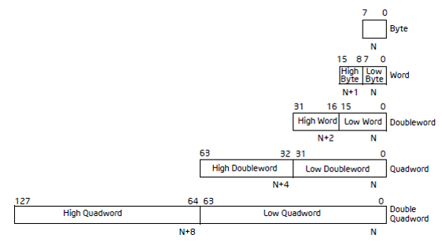
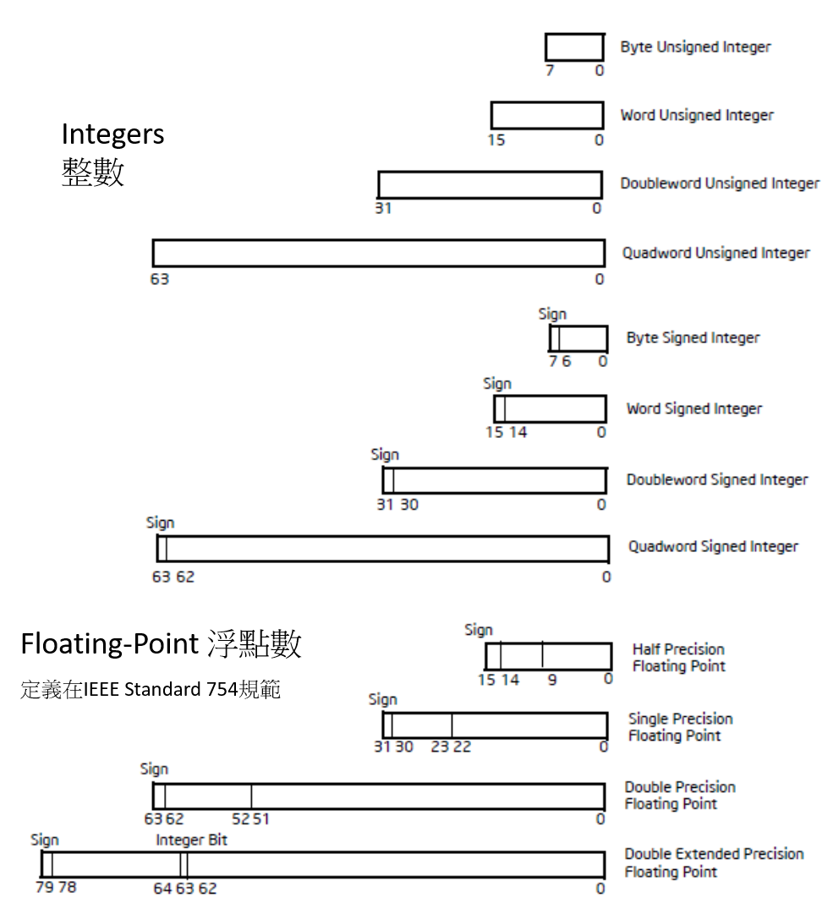

# register 暫存器
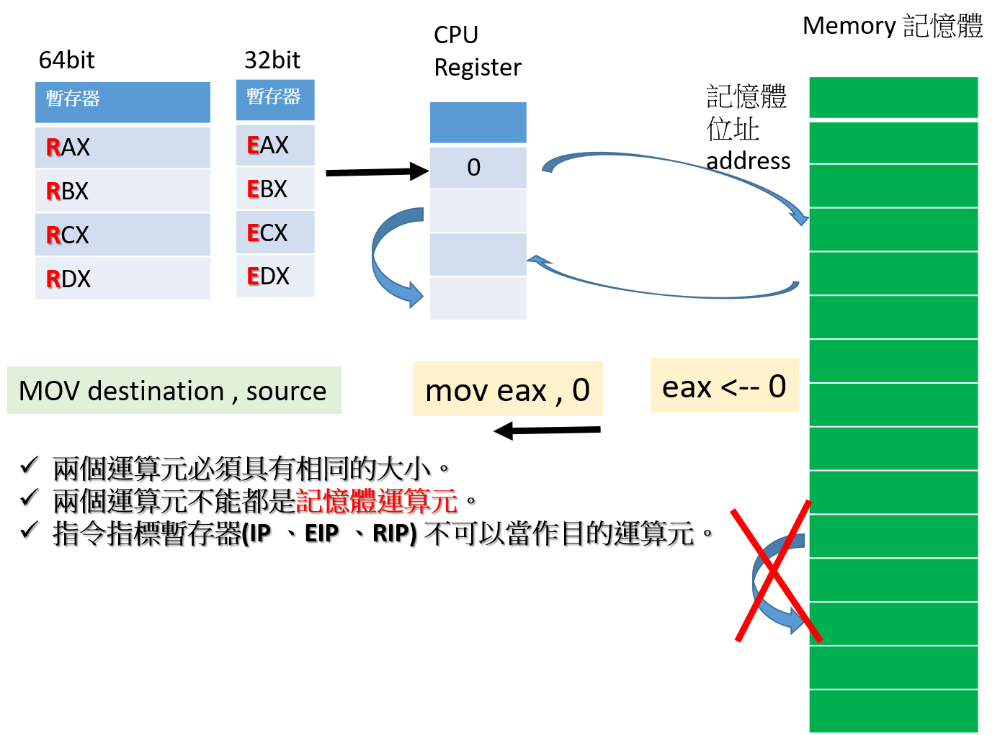

- 64位元暫存器 圖片來源:https://www.anandtech.com/show/598/5
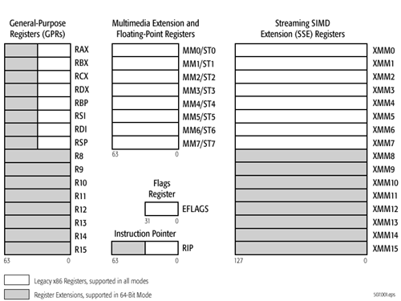

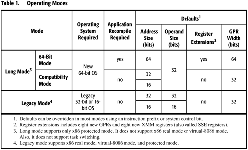
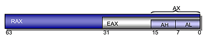

- 32位元暫存器
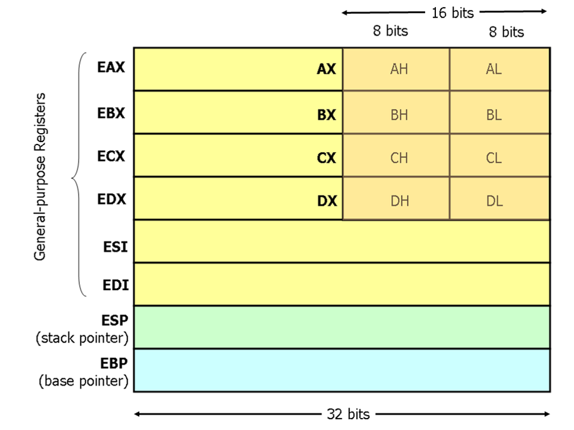

- 32位元nasm程式  vs  64位元nasm程式
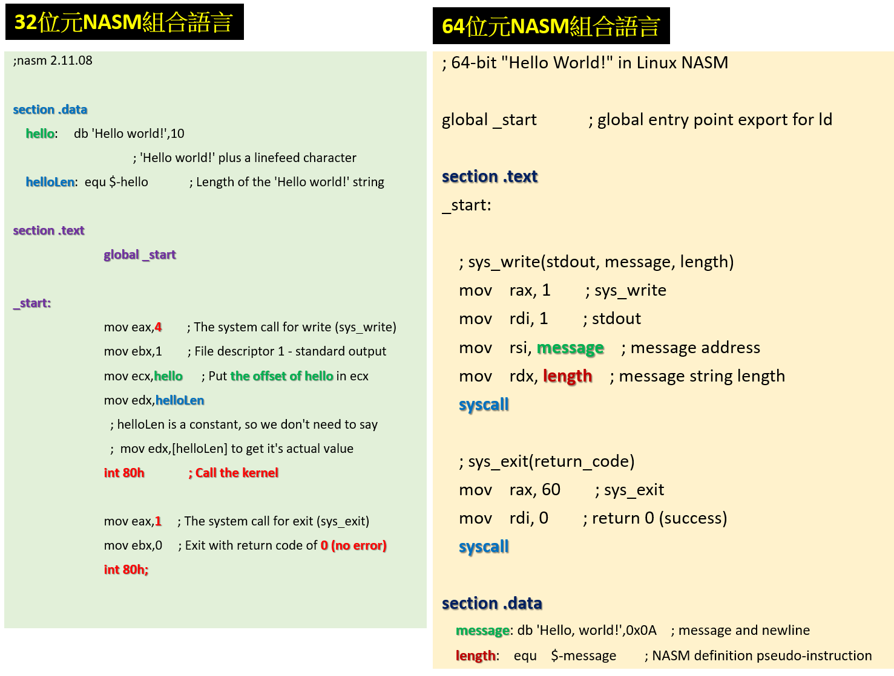

# 組合語言與組譯器(assembler)
- https://en.wikipedia.org/wiki/Comparison_of_assemblers
- NASM(Netwide Assembler):本課程使用
- GNU Assembler (GAS): 
- MASM(Microsoft Macro Assembler)
- Flat Assembler (FASM)

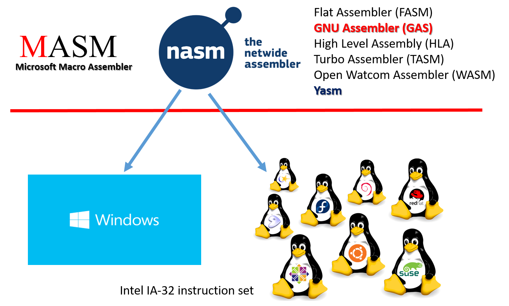

### 學習組合語言:推薦書籍
- [Beginning X64 Assembly Programming: From Novice to Avx Professional](https://www.tenlong.com.tw/products/9781484250754?list_name=srh)
  - [簡體中文版:x64 匯編語言：從新手到 AVX 專家 ](https://www.tenlong.com.tw/products/9787302595465?list_name=srh)
  - GITHUB ==> https://github.com/Apress/beginning-x64-assembly-programming/tree/master
- [匯編程序設計與電腦體系結構：軟件工程師教程(簡體中文)](https://www.tenlong.com.tw/products/9787111615163?list_name=srh)
  - 以x86與x86_64這兩種主流架構為重點，兼顧AT&T及Intel語法
  - 使用GAS、NASM及MASM三種常見的匯編器
  - Linux、macOS及Windows三種常用的操作系統
  - GITHUB ==> https://github.com/brianrhall/Assembly

### 學習MASM組合語言
- Assembly Language for x86 Processors
- http://www.asmirvine.com/
- [簡體中文: 彙編語言：基於x86處理器（原書第8版)](https://www.tenlong.com.tw/products/9787111690436?list_name=srh)
- [繁體中文:組合語言, 7/e (國際版) (Assembly Language for x86 Processors,7/e)](https://www.tenlong.com.tw/products/9789862803486?list_name=srh)

### 其他書籍
- [Modern X86 Assembly Language Programming: Covers X86 64-bit, AVX, AVX2, and AVX-512 3rd ed](https://www.tenlong.com.tw/products/9781484296028?list_name=srh)
  - [簡體中文:現代 x86 彙編語言程序設計, 2/e](https://www.tenlong.com.tw/products/9787111686088)
  - GITHUB ==> https://github.com/Apress/modern-x86-assembly-language-programming-2e
