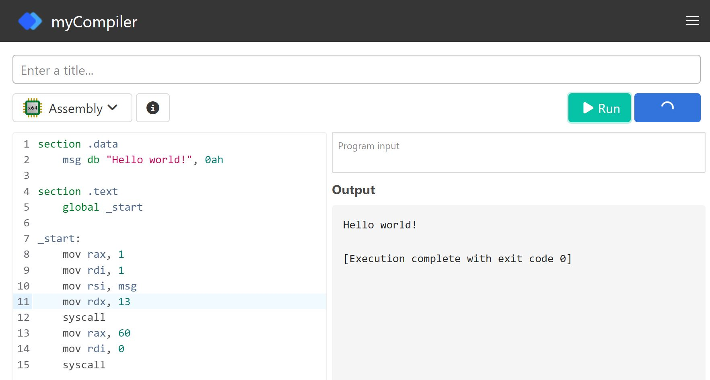

# 3-2.NASM(Netwide Assembler)組合程式設計

## NASM(Netwide Assembler)
## NASM開發環境1:線上開發環境
- myCompiler(64位元)  https://www.mycompiler.io/new/asm-x86_64
 
- NASM online(32位元) http://rextester.com/l/nasm_online_compiler
## NASM開發環境:在Ubuntu Linux上安裝 NASM(以nasm 2.14為例)
- 抓取檔案nasm-2.14 ==> wget https://www.nasm.us/pub/nasm/releasebuilds/2.14/nasm-2.14.tar.gz
- 解壓縮 ==> tar xvf nasm-2.14.tar.gz
- 切換到 nasm-2.14目錄  ==> cd nasm-2.14
- 設定安裝到目錄 ==> ./configure — prefix=/usr
  - 注意：prefix前面是兩個-
- 編譯與安裝 ==> sudo make install
- 檢視nasm安裝版本==>  nasm -v
- 檢視nasm 指令參數 ==> nasm -h
- 檢視線上文件(最新版是2.16) ==> https://www.nasm.us/doc/

## NASM 組合程式架構
- https://cs.lmu.edu/~ray/notes/nasmtutorial/

## 網路上分享的NASM 組合程式範例
- [NASM Tutorial(使用Mac上的nasm)](https://cs.lmu.edu/~ray/notes/nasmtutorial/)
- [NASM on Windows程式範例](https://www.davidgrantham.com/)
## 網路上分享的NASM 組合程式教學
- [A - Z Nasm Assembly 64Bit Programming - Loop, Stack, prinf, scanf, conditions](https://www.youtube.com/watch?v=5eWiz3soaEM)
## NASM 組合程式開發步驟
- 步驟1:使用你熟悉的編輯器來撰寫程式碼
  - gedit
  - vim
  - 副檔名: hello-world.asm
- 步驟2: 程式碼組譯
  - 產生64位元==> nasm -f elf64 hello-world.asm
  - 產生32位元==> nasm -f elf32 hello-world.asm
  - 產生 hello-world.o
- 步驟3:連結 == > ld hello-world.o -o hello-world
  -  產生hello-world執行檔
- 步驟4:程式執行  == > ./hello-world

## 第一支組合程式
- https://pastebin.com/3gMBBCbj
- https://www.cs.fsu.edu/~langley/CNT5605/2017-Summer/assembly-example/assembly.html
```nasm
section .data
    text db "Hello, World!",10
 
section .text
    global _start
 
_start:
    mov rax, 1
    mov rdi, 1
    mov rsi, text
    mov rdx, 14
    syscall
 
    mov rax, 60
    mov rdi, 0
    syscall
```

