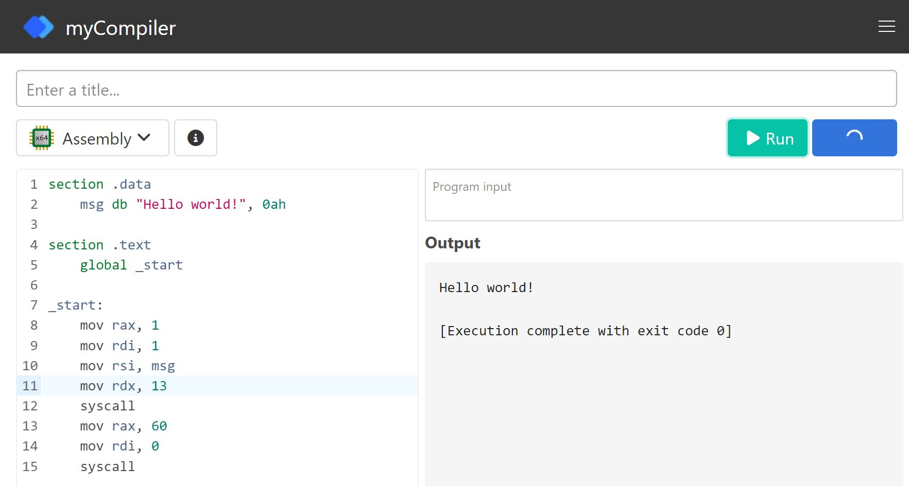
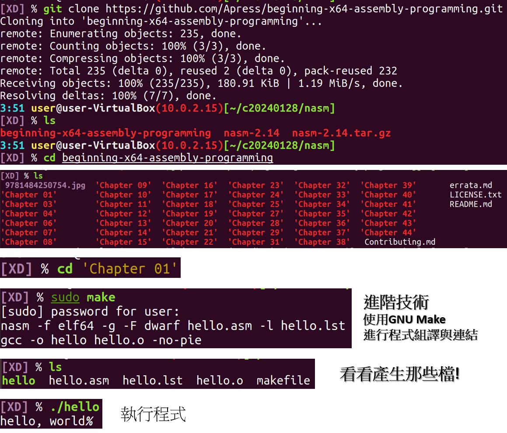

# 3-3.NASM(Netwide Assembler)組合程式設計

## NASM(Netwide Assembler)
- 官方文件 https://www.nasm.us/xdoc/2.15/html/

## NASM開發環境1:線上開發環境
- myCompiler(64位元)  https://www.mycompiler.io/new/asm-x86_64
 
- NASM online(32位元) http://rextester.com/l/nasm_online_compiler
## NASM開發環境:在Ubuntu Linux上安裝 NASM(以nasm 2.14為例)
- 抓取檔案nasm-2.14 ==> wget https://www.nasm.us/pub/nasm/releasebuilds/2.14/nasm-2.14.tar.gz
- 解壓縮 ==> tar xvf nasm-2.14.tar.gz
- 切換到 nasm-2.14目錄  ==> cd nasm-2.14
- 設定安裝到目錄 ==> ./configure — prefix=/usr
  - 注意：prefix前面是兩個-
- 編譯與安裝 ==> sudo make install
- 檢視nasm安裝版本==>  nasm -v
- 檢視nasm 指令參數 ==> nasm -h
- 檢視線上文件(最新版是2.16) ==> https://www.nasm.us/doc/

## NASM 組合程式架構
- https://cs.lmu.edu/~ray/notes/nasmtutorial/

## 網路上分享的NASM 組合程式範例
- [NASM Tutorial(使用Mac上的nasm)](https://cs.lmu.edu/~ray/notes/nasmtutorial/)
- [NASM on Windows程式範例](https://www.davidgrantham.com/)
- [](https://redirect.cs.umbc.edu/portal/help/nasm/sample_64.shtml)
## 網路上分享的NASM 組合程式教學
- [A - Z Nasm Assembly 64Bit Programming - Loop, Stack, prinf, scanf, conditions](https://www.youtube.com/watch?v=5eWiz3soaEM)
## NASM 組合程式開發步驟
- 步驟1:使用你熟悉的編輯器來撰寫程式碼
  - gedit
  - vim
  - 副檔名: hello-world.asm
- 步驟2: 程式碼組譯
  - 產生64位元==> nasm -f elf64 hello-world.asm
  - 產生32位元==> nasm -f elf32 hello-world.asm
  - 產生 hello-world.o
- 步驟3:連結 == > ld hello-world.o -o hello-world
  -  產生hello-world執行檔
- 步驟4:程式執行  == > ./hello-world

## 第一支32位元組合程式HelloCTFer_32.asm
```
;nasm 2.13.02

section .data
    hello:     db 'Hello CTFer!',10    ; 'Hello CTFer!' plus a linefeed character
    helloLen:  equ $-hello             ; Length of the 'Hello world!' string

section .text
	global _start

_start:
	mov eax,4            ; The system call for write (sys_write)
	mov ebx,1            ; File descriptor 1 - standard output
	mov ecx,hello        ; Put the offset of hello in ecx
	mov edx,helloLen     ; helloLen is a constant, so we don't need to say
	                     ;  mov edx,[helloLen] to get it's actual value
	int 80h              ; Call the kernel

	mov eax,1            ; The system call for exit (sys_exit)
	mov ebx,0            ; Exit with return code of 0 (no error)
	int 80h;
```
- 線上32位元 nasm 平台
- 32位元系統呼叫
  - https://faculty.nps.edu/cseagle/assembly/sys_call.html
- 組譯 ==> nasm -f elf32 -g -F dwarf hello.asm -l hello.lst
- 連結 ==> gcc -o hello hello.o -no-pie
- 更多程式範例
  - https://asmtutor.com/
  - https://github.com/DGivney/assemblytutorials/tree/master 
- 推薦範例
  - [Assembly Programming Tutorial](https://www.tutorialspoint.com/assembly_programming/assembly_variables.htm)
    - [Recursion_ factorial階乘](https://www.tutorialspoint.com/assembly_programming/assembly_recursion.htm)
  - https://redirect.cs.umbc.edu/portal/help/nasm/sample_64.shtml 

## 第一支64位元組合程式HelloCTFer_64.asm
- https://pastebin.com/3gMBBCbj
- https://www.cs.fsu.edu/~langley/CNT5605/2017-Summer/assembly-example/assembly.html
```nasm
section .data
    text db "Hello, CTFer!",10
 
section .text
    global _start
 
_start:
    mov rax, 1
    mov rdi, 1
    mov rsi, text
    mov rdx, 14
    syscall
 
    mov rax, 60
    mov rdi, 0
    syscall
```
- 線上64位元 nasm 平台
- 64位元系統呼叫
  - https://blog.rchapman.org/posts/Linux_System_Call_Table_for_x86_64/ 
- 組譯 ==> nasm -f elf64 -g -F dwarf hello.asm -l hello.lst
- 連結 ==> gcc -o hello hello.o -no-pie

# 教材導讀
- [Beginning X64 Assembly Programming: From Novice to Avx Professional](https://www.tenlong.com.tw/products/9781484250754?list_name=srh)
  - [簡體中文版:x64 匯編語言：從新手到 AVX 專家 ](https://www.tenlong.com.tw/products/9787302595465?list_name=srh)
  - GITHUB ==> https://github.com/Apress/beginning-x64-assembly-programming/tree/master
    - git clone https://github.com/Apress/beginning-x64-assembly-programming.git
    - cd beginning-x64-assembly-programming
    - ls
    - cd 'Chapter 01'
    - sudo make



#### 第一次學習:hello.asm
- hello.asm
```c
; hello.asm
section .data					
    msg	db      "hello, CTFer",0			

section .bss							

section .text							
    global main					
main:
						 
    mov     rax, 1		; 1 = write	
    mov     rdi, 1		; 1 = to stdout		
    mov     rsi, msg	        ; string to display in rsi
    mov     rdx, 12		; length of the string, without 0
    syscall				; display the string
    mov     rax, 60		; 60 = exit	
    mov     rdi, 0		; 0 = success exit code	
    syscall				; quit
```
- makefile
```
hello: hello.o
	gcc -o hello hello.o -no-pie
hello.o: hello.asm
	nasm -f elf64 -g -F dwarf hello.asm -l hello.lst
```
- 執行 make
- 執行 hello

### 使用 gdb 分析hello執行檔


#### if 功能 Chapter 07/07 jump/jump.asm
```c
; jump.asm
extern printf
section .data							
	number1	dq	42					
	number2	dq	41
	fmt1	db	"NUMBER1 > = NUMBER2",10,0
	fmt2	db	"NUMBER1 < NUMBER2",10,0					
section .bss
section .text							
	global 	main						
main:
        mov rbp, rsp; for correct debugging
	push	rbp
	mov	rbp,rsp

	mov 	rax, [number1]	; move the numbers into registers
	mov 	rbx, [number2]

	cmp 	rax,rbx		; 比較 rax(42) and rbx(43)
	jge 	greater		; 若  rax >= 就跳到 greater:
        mov	rdi,fmt2	; rax(42) < rbx(43), 繼續往下執行
        mov	rax,0		; no xmm involved
	call 	printf		; 列印 fmt2字串"NUMBER1 < NUMBER2"
	jmp 	exit		; jump to label exit:

greater:
	mov	rdi,fmt1	; rax is greater			
	mov	rax,0		; no xmm involved
	call 	printf		; display fmt1

exit:	mov	rsp,rbp
	pop	rbp
	ret
```
