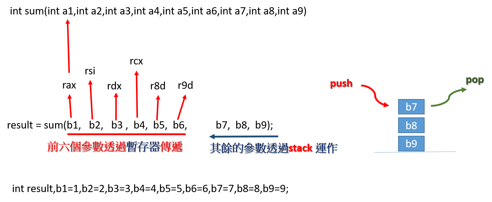

# c vs assembly
- C 程式編譯成執行檔  == > gcc XXX.c -o XXX `-g`
- 將執行檔逆向成組合語言 == > objdump -S -j .text -M intel XXX --no-show-raw-insn


## 範例1
```c
#include <stdio.h>
int main()
{
   int a = 11111, b = 22222;
   printf("%d", (a++)+(++b));
   return 0;
}
```
```c
000000000000064a <main>:
#include <stdio.h>
int main()
{
 64a:	push   rbp
 64b:	mov    rbp,rsp
 64e:	sub    rsp,0x10
   int a = 11111, b = 22222;
 652:	mov    DWORD PTR [rbp-0x8],0x2b67
 659:	mov    DWORD PTR [rbp-0x4],0x56ce
   printf("%d", (a++)+(++b));
 660:	mov    eax,DWORD PTR [rbp-0x8]  # eax <--a值  ==> 儲存在register
 663:	lea    edx,[rax+0x1]
 666:	mov    DWORD PTR [rbp-0x8],edx  # a++ ==> 存在記憶體
 669:	add    DWORD PTR [rbp-0x4],0x1  # 先執行 ++b 
 66d:	mov    edx,DWORD PTR [rbp-0x4]  # edx <--(++b)
 670:	add    eax,edx                  # 
 672:	mov    esi,eax
 674:	lea    rdi,[rip+0x99]        # 714 <_IO_stdin_used+0x4>
 67b:	mov    eax,0x0
 680:	call   520 <printf@plt>
   return 0;
 685:	mov    eax,0x0
}
 68a:	leave  
 68b:	ret    
 68c:	nop    DWORD PTR [rax+0x0]
```

## 範例2: if
```c
#include<stdio.h>
 
int main()
{
    int num;
 
    printf("請輸入一個正整數 : ");
    scanf("%d",&num);
 
    if (num%2==0)
      printf("你輸入的偶數");
}
```
```c
000000000000071a <main>:
#include<stdio.h>
 
int main()
{
 71a:	push   rbp
 71b:	mov    rbp,rsp
 71e:	sub    rsp,0x10
 722:	mov    rax,QWORD PTR fs:0x28
 72b:	mov    QWORD PTR [rbp-0x8],rax
 72f:	xor    eax,eax
    int num;
 
    printf("請輸入一個正整數 : ");
 731:	lea    rdi,[rip+0xdc]        # 814 <_IO_stdin_used+0x4>
 738:	mov    eax,0x0
 73d:	call   5e0 <printf@plt>
    scanf("%d",&num);
 742:	lea    rax,[rbp-0xc]
 746:	mov    rsi,rax
 749:	lea    rdi,[rip+0xe0]        # 830 <_IO_stdin_used+0x20>
 750:	mov    eax,0x0
 755:	call   5f0 <__isoc99_scanf@plt>
 
    if (num%2==0)
 75a:	mov    eax,DWORD PTR [rbp-0xc]
 75d:	and    eax,0x1
 760:	test   eax,eax
 762:	jne    775 <main+0x5b>
      printf("你輸入的偶數");
 764:	lea    rdi,[rip+0xc8]        # 833 <_IO_stdin_used+0x23>
 76b:	mov    eax,0x0
 770:	call   5e0 <printf@plt>
 775:	mov    eax,0x0
}
 77a:	mov    rdx,QWORD PTR [rbp-0x8]
 77e:	xor    rdx,QWORD PTR fs:0x28
 787:	je     78e <main+0x74>
 789:	call   5d0 <__stack_chk_fail@plt>
 78e:	leave  
 78f:	ret    
```


## 範例3: loop
```c
//FOR LOOP

#include <stdio.h>
int main() {
    int n, i, sum = 0;

    printf("Enter a positive integer: ");
    scanf("%d", &n);

    for (i = 1; i <= n; ++i) {
        sum += i;  // sum = sum +i
    }

    printf("Sum = %d", sum);
    return 0;
}
```
```c
000000000000071a <main>:
#include <stdio.h>
int main() {
 71a:	push   rbp
 71b:	mov    rbp,rsp
 71e:	sub    rsp,0x20
 722:	mov    rax,QWORD PTR fs:0x28
 72b:	mov    QWORD PTR [rbp-0x8],rax
 72f:	xor    eax,eax
    int n, i, sum = 0;
 731:	mov    DWORD PTR [rbp-0xc],0x0

    printf("Enter a positive integer: ");
 738:	lea    rdi,[rip+0xf5]        # 834 <_IO_stdin_used+0x4>
 73f:	mov    eax,0x0
 744:	call   5e0 <printf@plt>
    scanf("%d", &n);
 749:	lea    rax,[rbp-0x14]
 74d:	mov    rsi,rax
 750:	lea    rdi,[rip+0xf8]        # 84f <_IO_stdin_used+0x1f>
 757:	mov    eax,0x0
 75c:	call   5f0 <__isoc99_scanf@plt>

    for (i = 1; i <= n; ++i) {
 761:	mov    DWORD PTR [rbp-0x10],0x1
 768:	jmp    774 <main+0x5a>
        sum += i;  // sum = sum +i
 76a:	mov    eax,DWORD PTR [rbp-0x10]
 76d:	add    DWORD PTR [rbp-0xc],eax
    for (i = 1; i <= n; ++i) {
 770:	add    DWORD PTR [rbp-0x10],0x1
 774:	mov    eax,DWORD PTR [rbp-0x14]
 777:	cmp    DWORD PTR [rbp-0x10],eax
 77a:	jle    76a <main+0x50>
    }

    printf("Sum = %d", sum);
 77c:	mov    eax,DWORD PTR [rbp-0xc]
 77f:	mov    esi,eax
 781:	lea    rdi,[rip+0xca]        # 852 <_IO_stdin_used+0x22>
 788:	mov    eax,0x0
 78d:	call   5e0 <printf@plt>
    return 0;
 792:	mov    eax,0x0
}
 797:	mov    rdx,QWORD PTR [rbp-0x8]
 79b:	xor    rdx,QWORD PTR fs:0x28
 7a4:	je     7ab <main+0x91>
 7a6:	call   5d0 <__stack_chk_fail@plt>
 7ab:	leave  
 7ac:	ret    
 7ad:	nop    DWORD PTR [rax]
```


# 函數與函數呼叫 ==> Calling convention
## 範例4:函數
```c
#include <stdio.h>
 
int ifactorial(int z)
{
	int mul = 1, i = 1;
	while(i <= z)
	{
		mul *= i;
		i++;
	};
	return mul;
}

int  main()
{
    int i = 4;
    printf("%d 的階乘為%d\n", i, ifactorial(i));
    return 0;
}
```
```c
000000000000064a <ifactorial>:
#include <stdio.h>
 
int ifactorial(int z)
{
 64a:	push   rbp
 64b:	mov    rbp,rsp
 64e:	mov    DWORD PTR [rbp-0x14],edi
	int mul = 1, i = 1;
 651:	mov    DWORD PTR [rbp-0x8],0x1
 658:	mov    DWORD PTR [rbp-0x4],0x1
	while(i <= z)
 65f:	jmp    66f <ifactorial+0x25>
	{
		mul *= i;
 661:	mov    eax,DWORD PTR [rbp-0x8]
 664:	imul   eax,DWORD PTR [rbp-0x4]
 668:	mov    DWORD PTR [rbp-0x8],eax
		i++;
 66b:	add    DWORD PTR [rbp-0x4],0x1
	while(i <= z)
 66f:	mov    eax,DWORD PTR [rbp-0x4]
 672:	cmp    eax,DWORD PTR [rbp-0x14]
 675:	jle    661 <ifactorial+0x17>
	};
	return mul;
 677:	mov    eax,DWORD PTR [rbp-0x8]
}
 67a:	pop    rbp
 67b:	ret    

000000000000067c <main>:

int  main()
{
 67c:	push   rbp
 67d:	mov    rbp,rsp
 680:	sub    rsp,0x10
    int i = 4;
 684:	mov    DWORD PTR [rbp-0x4],0x4
    printf("%d 的階乘為%d\n", i, ifactorial(i));
 68b:	mov    eax,DWORD PTR [rbp-0x4]
 68e:	mov    edi,eax
 690:	call   64a <ifactorial>
 695:	mov    edx,eax
 697:	mov    eax,DWORD PTR [rbp-0x4]
 69a:	mov    esi,eax
 69c:	lea    rdi,[rip+0xa1]        # 744 <_IO_stdin_used+0x4>
 6a3:	mov    eax,0x0
 6a8:	call   520 <printf@plt>
    return 0;
 6ad:	mov    eax,0x0
}
 6b2:	leave  
 6b3:	ret    
 6b4:	nop    WORD PTR cs:[rax+rax*1+0x0]
 6be:	xchg   ax,ax

```


## 範例5:
```c
#include <stdio.h>
/* 函數的宣告 */
void swap (int a, int b);

int main (void) {
  int i = 11, j = 22;
  printf ("i = %d, j = %d\n" , i, j);
  swap (i, j);
  printf ("i = %d, j = %d\n" , i, j);
  return 0;
}

void swap (int a, int b) {
  printf ("互換前:a = %d, b = %d\n" , a, b);
  int temp = a;
  a = b;
  b = temp;
  printf ("互換後:a = %d, b = %d\n" , a, b);
}
```
```c
000000000000064a <main>:
#include <stdio.h>
/* 函數的宣告 */
void swap (int a, int b);

int main (void) {
 64a:	push   rbp
 64b:	mov    rbp,rsp
 64e:	sub    rsp,0x10
  int i = 11, j = 22;
 652:	mov    DWORD PTR [rbp-0x8],0xb
 659:	mov    DWORD PTR [rbp-0x4],0x16
  printf ("i = %d, j = %d\n" , i, j);
 660:	mov    edx,DWORD PTR [rbp-0x4]
 663:	mov    eax,DWORD PTR [rbp-0x8]
 666:	mov    esi,eax
 668:	lea    rdi,[rip+0x115]        # 784 <_IO_stdin_used+0x4>
 66f:	mov    eax,0x0
 674:	call   520 <printf@plt>
  swap (i, j);
 679:	mov    edx,DWORD PTR [rbp-0x4]
 67c:	mov    eax,DWORD PTR [rbp-0x8]
 67f:	mov    esi,edx
 681:	mov    edi,eax
 683:	call   6a8 <swap>
  printf ("i = %d, j = %d\n" , i, j);
 688:	mov    edx,DWORD PTR [rbp-0x4]
 68b:	mov    eax,DWORD PTR [rbp-0x8]
 68e:	mov    esi,eax
 690:	lea    rdi,[rip+0xed]        # 784 <_IO_stdin_used+0x4>
 697:	mov    eax,0x0
 69c:	call   520 <printf@plt>
  return 0;
 6a1:	mov    eax,0x0
}
 6a6:	leave  
 6a7:	ret    

00000000000006a8 <swap>:

void swap (int a, int b) {
 6a8:	push   rbp
 6a9:	mov    rbp,rsp
 6ac:	sub    rsp,0x20
 6b0:	mov    DWORD PTR [rbp-0x14],edi
 6b3:	mov    DWORD PTR [rbp-0x18],esi
  printf ("互換前:a = %d, b = %d\n" , a, b);
 6b6:	mov    edx,DWORD PTR [rbp-0x18]
 6b9:	mov    eax,DWORD PTR [rbp-0x14]
 6bc:	mov    esi,eax
 6be:	lea    rdi,[rip+0xcf]        # 794 <_IO_stdin_used+0x14>
 6c5:	mov    eax,0x0
 6ca:	call   520 <printf@plt>
  int temp = a;
 6cf:	mov    eax,DWORD PTR [rbp-0x14]
 6d2:	mov    DWORD PTR [rbp-0x4],eax
  a = b;
 6d5:	mov    eax,DWORD PTR [rbp-0x18]
 6d8:	mov    DWORD PTR [rbp-0x14],eax
  b = temp;
 6db:	mov    eax,DWORD PTR [rbp-0x4]
 6de:	mov    DWORD PTR [rbp-0x18],eax
  printf ("互換後:a = %d, b = %d\n" , a, b);
 6e1:	mov    edx,DWORD PTR [rbp-0x18]
 6e4:	mov    eax,DWORD PTR [rbp-0x14]
 6e7:	mov    esi,eax
 6e9:	lea    rdi,[rip+0xbe]        # 7ae <_IO_stdin_used+0x2e>
 6f0:	mov    eax,0x0
 6f5:	call   520 <printf@plt>
}
 6fa:	nop
 6fb:	leave  
 6fc:	ret    
 6fd:	nop    DWORD PTR [rax]
```


## 範例6
```c
#include <stdio.h>

int sum(int a1,int a2,int a3,int a4,int a5,int a6,int a7,int a8,int a9)
{
  return a1+a2+a3+a4+a5+a6+a7+a8+a9;
}

int main()
{
  int result,b1=1,b2=2,b3=3,b4=4,b5=5,b6=6,b7=7,b8=8,b9=9;
  result = sum(b1,b2,b3,b4,b5,b6,b7,b8,b9);
  printf("sum is %d\n",result);
  return 0;
}
```



```c
000000000000064a <sum>:
#include <stdio.h>

int sum(int a1,int a2,int a3,int a4,int a5,int a6,int a7,int a8,int a9)
{
 64a:	push   rbp
 64b:	mov    rbp,rsp
 64e:	mov    DWORD PTR [rbp-0x4],edi
 651:	mov    DWORD PTR [rbp-0x8],esi
 654:	mov    DWORD PTR [rbp-0xc],edx
 657:	mov    DWORD PTR [rbp-0x10],ecx
 65a:	mov    DWORD PTR [rbp-0x14],r8d
 65e:	mov    DWORD PTR [rbp-0x18],r9d
  return a1+a2+a3+a4+a5+a6+a7+a8+a9;
 662:	mov    edx,DWORD PTR [rbp-0x4]
 665:	mov    eax,DWORD PTR [rbp-0x8]
 668:	add    edx,eax
 66a:	mov    eax,DWORD PTR [rbp-0xc]
 66d:	add    edx,eax
 66f:	mov    eax,DWORD PTR [rbp-0x10]
 672:	add    edx,eax
 674:	mov    eax,DWORD PTR [rbp-0x14]
 677:	add    edx,eax
 679:	mov    eax,DWORD PTR [rbp-0x18]
 67c:	add    edx,eax
 67e:	mov    eax,DWORD PTR [rbp+0x10]
 681:	add    edx,eax
 683:	mov    eax,DWORD PTR [rbp+0x18]
 686:	add    edx,eax
 688:	mov    eax,DWORD PTR [rbp+0x20]
 68b:	add    eax,edx
}
 68d:	pop    rbp
 68e:	ret    

000000000000068f <main>:

int main()
{
 68f:	push   rbp
 690:	mov    rbp,rsp
 693:	sub    rsp,0x30
  int result,b1=1,b2=2,b3=3,b4=4,b5=5,b6=6,b7=7,b8=8,b9=9;
 697:	mov    DWORD PTR [rbp-0x28],0x1
 69e:	mov    DWORD PTR [rbp-0x24],0x2
 6a5:	mov    DWORD PTR [rbp-0x20],0x3
 6ac:	mov    DWORD PTR [rbp-0x1c],0x4
 6b3:	mov    DWORD PTR [rbp-0x18],0x5
 6ba:	mov    DWORD PTR [rbp-0x14],0x6
 6c1:	mov    DWORD PTR [rbp-0x10],0x7
 6c8:	mov    DWORD PTR [rbp-0xc],0x8
 6cf:	mov    DWORD PTR [rbp-0x8],0x9
  result = sum(b1,b2,b3,b4,b5,b6,b7,b8,b9);
 6d6:	mov    r9d,DWORD PTR [rbp-0x14]
 6da:	mov    r8d,DWORD PTR [rbp-0x18]
 6de:	mov    ecx,DWORD PTR [rbp-0x1c]
 6e1:	mov    edx,DWORD PTR [rbp-0x20]
 6e4:	mov    esi,DWORD PTR [rbp-0x24]
 6e7:	mov    eax,DWORD PTR [rbp-0x28]
 6ea:	mov    edi,DWORD PTR [rbp-0x8]
 6ed:	push   rdi
 6ee:	mov    edi,DWORD PTR [rbp-0xc]
 6f1:	push   rdi
 6f2:	mov    edi,DWORD PTR [rbp-0x10]
 6f5:	push   rdi
 6f6:	mov    edi,eax
 6f8:	call   64a <sum>
 6fd:	add    rsp,0x18
 701:	mov    DWORD PTR [rbp-0x4],eax
  printf("sum is %d\n",result);
 704:	mov    eax,DWORD PTR [rbp-0x4]
 707:	mov    esi,eax
 709:	lea    rdi,[rip+0xa4]        # 7b4 <_IO_stdin_used+0x4>
 710:	mov    eax,0x0
 715:	call   520 <printf@plt>
  return 0;
 71a:	mov    eax,0x0
}
 71f:	leave  
 720:	ret    
 721:	nop    WORD PTR cs:[rax+rax*1+0x0]
 72b:	nop    DWORD PTR [rax+rax*1+0x0]

```


## 範例7:遞迴函數
```c
#include <stdio.h>
 
double factorial(unsigned int i)
{
   if(i <= 1)
      return 1;
   else   return i * factorial(i - 1);
}

int  main()
{
    int i = 15;
    printf("%d 的階乘為%f\n", i, factorial(i));
    return 0;
}
```
```c
000000000000064a <factorial>:
#include <stdio.h>
 
double factorial(unsigned int i)
{
 64a:	push   rbp
 64b:	mov    rbp,rsp
 64e:	sub    rsp,0x10
 652:	mov    DWORD PTR [rbp-0x4],edi
   if(i <= 1)
 655:	cmp    DWORD PTR [rbp-0x4],0x1
 659:	ja     665 <factorial+0x1b>
      return 1;
 65b:	movsd  xmm0,QWORD PTR [rip+0x11d]        # 780 <_IO_stdin_used+0x20>
 663:	jmp    6a5 <factorial+0x5b>
   else   return i * factorial(i - 1);
 665:	mov    eax,DWORD PTR [rbp-0x4]
 668:	test   rax,rax
 66b:	js     679 <factorial+0x2f>
 66d:	cvtsi2sd xmm1,rax
 672:	movsd  QWORD PTR [rbp-0x10],xmm1
 677:	jmp    693 <factorial+0x49>
 679:	mov    rdx,rax
 67c:	shr    rdx,1
 67f:	and    eax,0x1
 682:	or     rdx,rax
 685:	cvtsi2sd xmm0,rdx
 68a:	addsd  xmm0,xmm0
 68e:	movsd  QWORD PTR [rbp-0x10],xmm0
 693:	mov    eax,DWORD PTR [rbp-0x4]
 696:	sub    eax,0x1
 699:	mov    edi,eax
 69b:	call   64a <factorial>
 6a0:	mulsd  xmm0,QWORD PTR [rbp-0x10]
}
 6a5:	leave  
 6a6:	ret    

00000000000006a7 <main>:

int  main()
{
 6a7:	push   rbp
 6a8:	mov    rbp,rsp
 6ab:	sub    rsp,0x10
    int i = 15;
 6af:	mov    DWORD PTR [rbp-0x4],0xf
    printf("%d 的階乘為%f\n", i, factorial(i));
 6b6:	mov    eax,DWORD PTR [rbp-0x4]
 6b9:	mov    edi,eax
 6bb:	call   64a <factorial>
 6c0:	mov    eax,DWORD PTR [rbp-0x4]
 6c3:	mov    esi,eax
 6c5:	lea    rdi,[rip+0x9c]        # 768 <_IO_stdin_used+0x8>
 6cc:	mov    eax,0x1
 6d1:	call   520 <printf@plt>
    return 0;
 6d6:	mov    eax,0x0
}
 6db:	leave  
 6dc:	ret    
 6dd:	nop    DWORD PTR [rax]

00000000000006e0 <__libc_csu_init>:
 6e0:	push   r15
 6e2:	push   r14
 6e4:	mov    r15,rdx
 6e7:	push   r13
 6e9:	push   r12
 6eb:	lea    r12,[rip+0x2006c6]        # 200db8 <__frame_dummy_init_array_entry>
 6f2:	push   rbp
 6f3:	lea    rbp,[rip+0x2006c6]        # 200dc0 <__init_array_end>
 6fa:	push   rbx
 6fb:	mov    r13d,edi
 6fe:	mov    r14,rsi
 701:	sub    rbp,r12
 704:	sub    rsp,0x8
 708:	sar    rbp,0x3
 70c:	call   4f0 <_init>
 711:	test   rbp,rbp
 714:	je     736 <__libc_csu_init+0x56>
 716:	xor    ebx,ebx
 718:	nop    DWORD PTR [rax+rax*1+0x0]
 720:	mov    rdx,r15
 723:	mov    rsi,r14
 726:	mov    edi,r13d
 729:	call   QWORD PTR [r12+rbx*8]
 72d:	add    rbx,0x1
 731:	cmp    rbp,rbx
 734:	jne    720 <__libc_csu_init+0x40>
 736:	add    rsp,0x8
 73a:	pop    rbx
 73b:	pop    rbp
 73c:	pop    r12
 73e:	pop    r13
 740:	pop    r14
 742:	pop    r15
 744:	ret    
 745:	nop
 746:	nop    WORD PTR cs:[rax+rax*1+0x0]
```


## 範例
```c

```
```c

```


